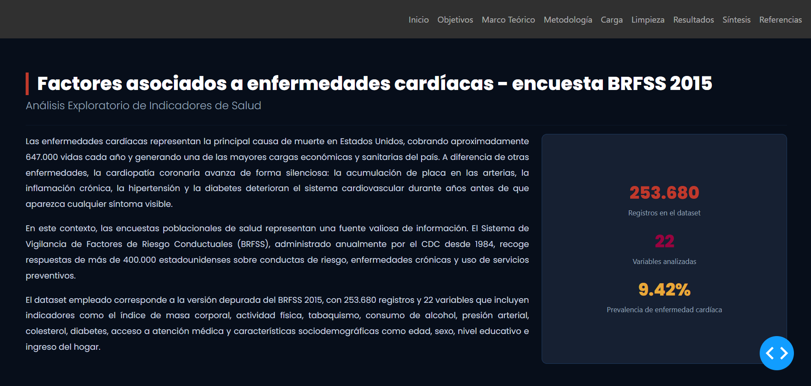

# Análisis Exploratorio de Indicadores de Salud y Factores Asociados a Enfermedades Cardíacas — BRFSS 2015



## Descripción

Este proyecto presenta un análisis exploratorio de datos (EDA) sobre los factores conductuales, clínicos y sociodemográficos asociados al riesgo de enfermedad cardíaca en adultos estadounidenses, utilizando la encuesta BRFSS 2015 del CDC. El análisis fue desarrollado como un dashboard interactivo construido con Python y la librería Dash.

El dataset empleado contiene 253.680 registros y 22 variables que incluyen indicadores como el índice de masa corporal, actividad física, tabaquismo, consumo de alcohol, presión arterial, colesterol, diabetes, acceso a atención médica y características sociodemográficas.

## Estructura del proyecto

```
EDA_heart-cop-copia/
├── assets/          ← Estilos CSS e íconos SVG
├── docs/            ← Dataset CSV y notebook original
├── pages/           ← Páginas del dashboard
│   ├── home.py
│   ├── objetivos.py
│   ├── marco_teorico.py
│   ├── metodologia.py
│   ├── carga.py
│   ├── limpieza.py
│   ├── resultados.py
│   ├── sintesis.py
│   └── referencias.py
├── app.py
├── index.py
└── requirements.txt
```

## Cómo correr el dashboard localmente

El dashboard fue desarrollado en Python usando la librería Dash. Para poder correrlo necesitas tener **Python 3.9 o superior** instalado en tu computador.

**1. Descomprime el archivo**

Extrae el archivo comprimido en la ubicación que prefieras de tu computador.

**2. (Opcional pero recomendado) Crea un entorno virtual**

```bash
python -m venv venv
```

Actívalo:

```bash
# Windows
venv\Scripts\activate

# Mac / Linux
source venv/bin/activate
```

**3. Instala las dependencias**

```bash
pip install -r requirements.txt
```

**4. Corre la aplicación**

```bash
python index.py
```

**5. Abre el dashboard en tu navegador**

```
http://localhost:8050/
```

> **Nota:** El archivo `heart_disease_health_indicators_BRFSS2015.csv` debe estar dentro de la carpeta `docs/`. No lo elimines ni lo muevas. La terminal debe permanecer abierta mientras uses el dashboard.

## Dataset

Los datos provienen del **Behavioral Risk Factor Surveillance System (BRFSS) 2015**, administrado por el CDC. La versión depurada utilizada en este proyecto fue publicada en Kaggle por Alex Teboul.

- [Ver dataset en Kaggle](https://www.kaggle.com/datasets/alexteboul/heart-disease-health-indicators-dataset/data)
- [Ver fuente original CDC](https://www.cdc.gov/brfss/annual_data/annual_2015.html)

## Equipo

Este proyecto fue desarrollado por:

- **Natalia Alvarado** — [GitHub](https://github.com/paolacorr67-ctrl)
- **Camilo Mujica** — [GitHub](https://github.com/camilo0709)
