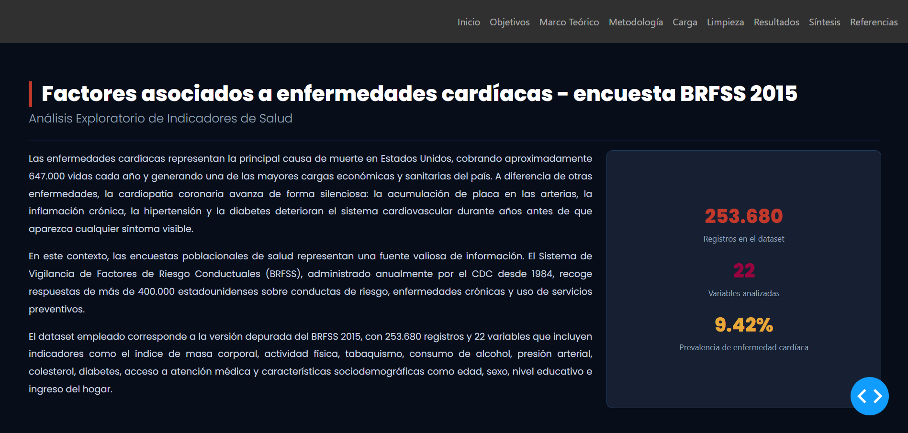

# Análisis Exploratorio de Indicadores de Salud y Factores Asociados a Enfermedades Cardíacas — BRFSS 2015



# Análisis exploratorio y modelado predictivo de enfermedades cardíacas — BRFSS 2015

Este proyecto presenta un análisis exploratorio de datos (EDA) y un modelo predictivo sobre los factores conductuales, clínicos y sociodemográficos asociados al riesgo de enfermedad cardíaca en adultos estadounidenses, utilizando la encuesta BRFSS 2015 del CDC. El análisis fue desarrollado como un dashboard interactivo construido con Python y la librería Dash, e incluye la comparación de cinco algoritmos de clasificación supervisada con selección del mejor modelo.

El dataset empleado contiene **253.680 registros** y **22 variables** que incluyen indicadores como el índice de masa corporal, actividad física, tabaquismo, consumo de alcohol, presión arterial, colesterol, diabetes, acceso a atención médica y características sociodemográficas.


# Estructura del proyecto

```text
EDA_heart-cop-copia/
├── assets/          # Estilos CSS e íconos SVG
├── docs/            # Dataset CSV y notebook original que tiene como nombre "eda12.ipynb"
├── pages/
│   ├── home.py
│   ├── objetivos.py
│   ├── marco_teorico.py
│   ├── metodologia.py
│   ├── carga.py
│   ├── limpieza.py
│   ├── resultados.py
│   ├── metricas.py
│   ├── modelo.py
│   ├── sintesis.py
│   └── referencias.py
├── app.py
├── index.py
└── requirements.txt
```


# Contenido del dashboard

| Sección | Descripción |
|----------|-------------|
| Inicio | Contexto del problema y estadísticas clave del dataset |
| Objetivos | Objetivo general y cinco objetivos específicos del análisis |
| Marco teórico | Conceptos fundamentales y métricas estadísticas utilizadas |
| Metodología | Estrategias aplicadas en el análisis univariado y bivariado |
| Carga de datos | Inspección inicial, tipos de variables y diccionario de datos |
| Limpieza | Verificación de nulos, duplicados y rangos esperados por variable |
| Resultados | Análisis univariado, bivariado, correlaciones e interacciones sinérgicas |
| Métricas del modelo | Comparación de cinco clasificadores, matrices de confusión y reducción de variables |
| Modelo predictivo | Formulario interactivo para estimar la probabilidad individual de enfermedad cardíaca |
| Síntesis | Conclusiones finales y hallazgos principales |
| Referencias | Fuentes bibliográficas en formato APA |


# Modelo predictivo

Se entrenaron y compararon cinco algoritmos de clasificación supervisada:

- Regresión Logística
- Random Forest
- K-Nearest Neighbors (KNN)
- Linear Support Vector Classifier (Linear SVC)
- XGBoost


# Cómo ejecutar el proyecto

## 1. Clonar el repositorio

```bash
git clone https://github.com/TU-USUARIO/EDA_heart-cop-copia.git
cd EDA_heart-cop-copia
```

## 2. Crear un entorno virtual (opcional)

```bash
python -m venv venv
```

Activarlo:

**Windows**

```bash
venv\Scripts\activate
```

**Mac/Linux**

```bash
source venv/bin/activate
```

## 3. Instalar dependencias

```bash
pip install -r requirements.txt
```

## 4. Ejecutar la aplicación

```bash
python index.py
```

## 5. Abrir el dashboard

En el navegador visita:

```
http://localhost:8050/
```

> **Importante:** El archivo `heart_disease_health_indicators_BRFSS2015.csv` debe permanecer dentro de la carpeta `docs/`.


# Dataset

Los datos provienen del **Behavioral Risk Factor Surveillance System (BRFSS) 2015**, administrado por los **Centers for Disease Control and Prevention (CDC)**.

La versión utilizada fue publicada en Kaggle por Alex Teboul.

- Dataset en Kaggle - [Link](https://www.kaggle.com/datasets/alexteboul/heart-disease-health-indicators-dataset/data)

- Fuente original del CDC - [Link](https://www.cdc.gov/brfss/annual_data/annual_2015.html)


# Equipo
Este proyecto fue desarrollado por:

* Natalia Alvarado — [GitHub](https://github.com/paolacorr67-ctrl)

* Camilo Mujica — [GitHub](https://github.com/camilo0709)